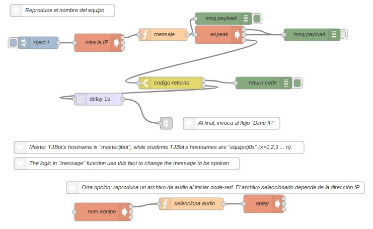
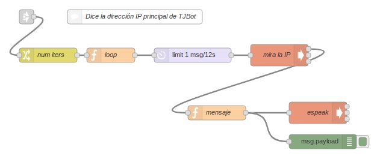
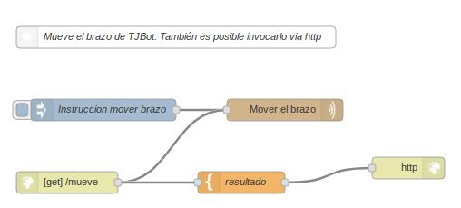
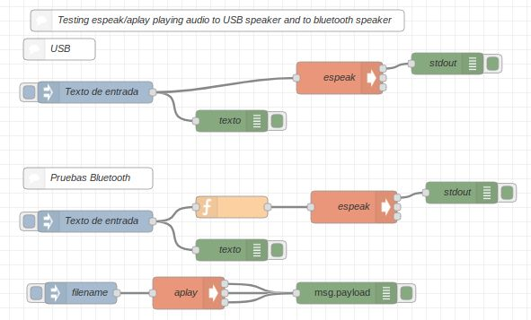
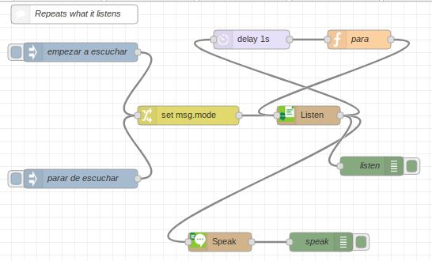
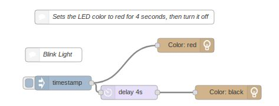
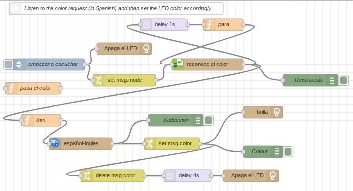
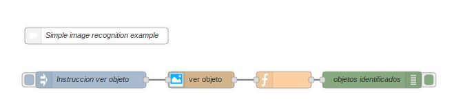
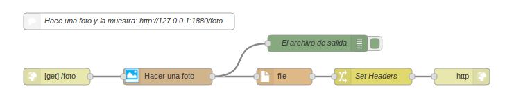
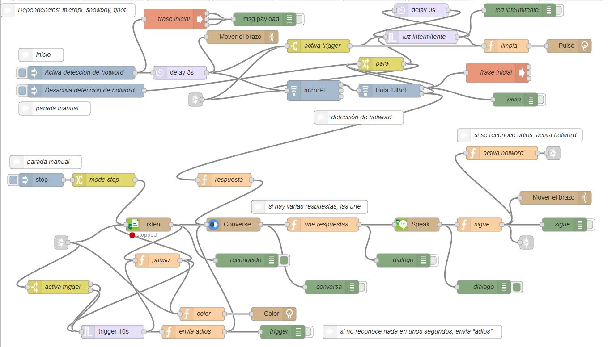

# tjbot-nodered-flows
## node-red flows created to show Watson services to students using TJBot

These node-red flows are used in a Spanish version of the TJBot "Activity Kit", see [What’s Possible With AI – TJ Bot](https://www.ibm.com/ibm/responsibility/initiatives/activitykits/tjbot/), available in the [IBM volunteers](https://www.ibm.com/volunteers/home.wss) web site. Some of these flows (or a simpler version of them) are built by the students following a document available in the kit, while others (like the "welcome" one) were created to help or amuse.

## Bienvenida (welcome)
 
This flow is automatically executed once when node-red starts. It checks raspberry's hostname and it synthesizes an audio message giving this information. It also checks the main IP address and plays it back. For this second task, another flow (Dime IP) is invoked. This way we show the concept of "wiring flows" ("link" node). 

For example, if the student TJBot's hostname is "equipotj01" and the IP address is 192.168.1.105, the audio played will be:

&nbsp;&nbsp;&nbsp;"soy el equipo 1. Mi dirección IP de wifi es 192.168.1.105"

The idea is that TJBot can be setup in a "headless" way, with no attached display to the raspberry. With this setup, TJBot will connect to a pre-defined wireless network. The student will connect to TJBot from a PC or laptop using VNC Viewer. In order to do that, they need to know the IP address assigned to TJBot, and that's where these two flows help.

The flow also shows an example of how to invoke shell commands from node-red and gather the standard output, standard error and the return code.

Flow dependencies:
* [espeak](http://espeak.sourceforge.net/): It can be installed from the command line doing a "sudo apt-get install espeak". It is a completely synthetic voice, it doesn't sound natural but it provides "local" text-to-speech services (not dependent on internet connection and/or IBM cloud service).
* A variant using aplay (see [aplay(1) - Linux man page](https://linux.die.net/man/1/aplay) ) to reproduce a pre-recorded audio file is also shown at the bottom.

## Dime IP (give my IP)

The purpose of this flow is explained above. The flow is designed so that the audio message reporting the IP address can be repeated several times (by default it is only played once) to give additional opportunities to the student of taking note of the IP address. It also introduces the use of variables and the "for loop" in JavaScript. 

Flow dependencies:
* [espeak](http://espeak.sourceforge.net/)(see above)

## Mover brazo (move arm)

This flow shows how to move TJBot's arm (servomotor). In this and other flows we use Jean Carl TJBot's nodes (see "dependencies" section). They are very robust and easy to use. 
The flow can be activated manually using the "inject" node, or it can also be accessed via web, for example: http://127.0.0.1:1880/mueve , using the loopback IP address (the assigned IP address is also valid). The flow introduces the "http in", "template" and "http response" nodes with this very simple example.

Flow dependencies:
* [Jean Carl's node-red-contrib-tjbot](https://github.com/jeancarl/node-red-contrib-tjbot): node "tjbot-wave"

## S. Hawking

This flow is a test bench to play with command invocation using espeak to synthesize speech and aplay to reproduce audio files.

It shows command options to reproduce audio to a USB speaker or a bluetooth one, and it encourages students to explore other options (e.g. setting the language, speed, pitch, etc).

Flow dependencies:
* [espeak](http://espeak.sourceforge.net/)(see above)

## Loro (parrot)

This flow uses Watson Speech to Text service to convert audio input captured from the microphone into text, and then it plays this text back through the speaker using Watson Text to Speech service. The flow introduces a feedback mechanism to stop "listening" once some text has been recognized. 

Flow dependencies:
* [Jean Carl's node-red-contrib-tjbot](https://github.com/jeancarl/node-red-contrib-tjbot): nodes "tjbot-listen" and "tjbot-speak"

## LED test 

This flow is basically one of the examples from Jean Carl. It sets a color on the LED and then after a few seconds it turns it off. 

Flow dependencies:
* [Jean Carl's node-red-contrib-tjbot](https://github.com/jeancarl/node-red-contrib-tjbot): nodes "tjbot-shine"

## LED voz (LED controlled via voice) 

This flow listens to the color request (in Spanish) and then set the LED color accordingly. The flow combines Watson Speech to Text to capture the request and Watson Language Translator services to translate the color name from Spanish to English.

Flow dependencies:
* [Jean Carl's node-red-contrib-tjbot](https://github.com/jeancarl/node-red-contrib-tjbot): nodes "tjbot-listen", "tjbot-translate" and "tjbot-shine"

## Reconocimiento de imagen (image recognition) 

This flow is also one of the examples from Jean Carl. It takes a photo using the Raspberry camera and analyzes it using Watson Visual Recognition service.

Flow dependencies:
* [Jean Carl's node-red-contrib-tjbot](https://github.com/jeancarl/node-red-contrib-tjbot): node "tjbot-see"

## Hacer una foto (take a photo)

This flow implements a web page that takes a photo using the Raspberry camera and then displays it on the same page.
Visit http://127.0.0.1:1880/foto (or the raspberry IP address).

Flow dependencies:
* [Jean Carl's node-red-contrib-tjbot](https://github.com/jeancarl/node-red-contrib-tjbot): nodes "tjbot-wave"

## Conversación (conversation)

This is the most complex flow of the series. It mimics the way "smart speakers" (like Amazon Echo or Google Home) works. 
It performs hotword ("Hola, tjbot") detection locally on the raspberry. When the hotword is detected, it carries out a conversation using Watson services: Speech to Text, Watson Assistant and Text to Speech. 
The flow is explained in one of the presentations and the students learn how to customize the conversation to their own needs.

This video shows an example of the conversation:

Flow dependencies:
* [node-red-contrib-micropi](https://flows.nodered.org/node/node-red-contrib-micropi). It allows recording and streaming audio from an usb microphone connected to a Raspberry Pi in Node-Red.
* [node-red-contrib-snowboy](https://flows.nodered.org/node/node-red-contrib-snowboy). A customizable hotword detection engine for you to create your own hotword like "OK Google" or "Alexa".
* [Jean Carl's node-red-contrib-tjbot](https://github.com/jeancarl/node-red-contrib-tjbot): node "tjbot-wave", "tjbot-listen", "tjbot-speak", "tjbot-shine" and "tjbot-converse"

